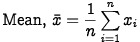
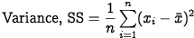

# The Mathematics behind the detectElevation funtion
***- Orondé Jabari Booker***

    var ...,
        avg = [0,0],
        lastPt = 0,
        currPt = 0,

        variance = [0,0],
        lambda = [0,0],
        ...;

    while(true){

      ...

      avg[0] += (currPt[0] - lastPt[0])/10;
      avg[1] += (currPt[1] - lastPt[1])/10;

      if(!refEstablished){
        lambda[0] += ((currPt[0]**2) - (lastPt[0]**2))/10;
        lambda[1] += ((currPt[1]**2) - (lastPt[1]**2))/10;

        variance[0] = lambda[0] + (avg[0]**2);
        variance[1] = lambda[1] + (avg[1]**2);

        ...
      }
      //breaking at some point here
      ...
    }

    How does this represent mean and variance?

**Introduction**

In order to program the Sphero to accurately detect a change in elevation, I
decided to compute the arithmetic mean and variance of the last 10 reported
values from the robot's gyroscopic sensor. The mean was calculated to represent
the Sphero's current orientation in order to reduce the noise in data caused by
slight offsets in the Sphero's path. The variance was used to determined when
the Sphero finished it's initial acceleration from rest.

As I wrote the detectElevation() function, the Sphero app would return an error
whenever I tried to use for loops to compute the mean and variance. That error
claimed that the for loops “ran too long without yielding”. I’m not entirely
sure why this occurred, but my best guess would be that it was due to a
limitation in the amount of memory and computational power of the Sphero. To
circumvent this, I reinterpreted the definitions of for mean and variance.

**Problem with For Loops**

  
  

The code with an endless while loop, in which we will break once we successfully
break out of once we detect a change in elevation, thus ending the program.

Now say that we are trying to compute the mean and variance using for loops.
In this case we get code similar to this:

      var vals = [0,0,0,0,0,0,0,0,0,0];

      while(true){
        var i,
            sum = 0;

        for(i=0; i<10; i++){
          sum += vals[i];
        }

        var mean = sum / 10;
        i = 0;
        sum = 0;

        for(i=0; i<10; i++){
          sum += (vals[i] - mean)**2;
        }

        var variance = sum / 10;
      }

The problem with using for loops in this case is that it you unfortunately leads
to calculating a sum for every iteration of code. Normally when programming for
an average computer, this inefficiency wouldn’t be a problem. However, our poor
Sphero doesn’t seem up to that computational burden. So to calculate mean
and variance, we:

1. Reduce the number of computations per cycle
2. Take liberties with the definitions written above (possibly)

Given these guidelines, I first started to work towards simplify the concept of
a summation within the context of the program.

In code, we have array that contains a certain number of the last recorded
values from the gyroscopic sensor. As a thought experiment, let’s assume that we
are recording the last four values, with a new value being recorded each cycle.
Now let’s imagine that four cycles have passed, meaning that we have four
recorded values already. Let the following expression represent the mean of
these supposed values (call them a,b,c,d and let their order the same as the
order in which we record them):
