# The Mathematics behind the detectElevation funtion
***- Orondé Jabari Booker***

    var ...,
        avg = [0,0],
        lastPt = 0,
        currPt = 0,

        variance = [0,0],
        lambda = [0,0],
        ...;

    while(true){

      ...

      avg[0] += (currPt[0] - lastPt[0])/10;
      avg[1] += (currPt[1] - lastPt[1])/10;

      if(!refEstablished){
        lambda[0] += ((currPt[0]**2) - (lastPt[0]**2))/10;
        lambda[1] += ((currPt[1]**2) - (lastPt[1]**2))/10;

        variance[0] = lambda[0] + (avg[0]**2);
        variance[1] = lambda[1] + (avg[1]**2);

        ...
      }
      //breaking at some point here
      ...
    }

    How does this represent mean and variance?

**Introduction**

In order to program the Sphero to accurately detect a change in elevation, I
decided to compute the arithmetic mean and variance of the last 10 reported
values from the robot's gyroscopic sensor. The mean was calculated to represent
the Sphero's current orientation in order to reduce the noise in data caused by
slight offsets in the Sphero's path. The variance was used to determined when
the Sphero finished it's initial acceleration from rest.

As I wrote the _detectElevation_ function, the Sphero app would return an error
whenever I tried to use for loops to compute the mean and variance. That error
claimed that the for loops “ran too long without yielding”. I’m not entirely
sure why this occurred, but my best guess would be that it was due to a
limitation in the amount of memory and computational power of the Sphero. To
circumvent this, I reinterpreted the definitions of for mean and variance.

**Problem with For Loops**

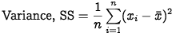

The bulk of the _detectElevation_ code runs within an endless while loop, out
of which we will break once a change in elevation is successfully detected,
thus ending the program.

Below is an example of code that shows what computing the mean and variance of
the last ten reported values would look like:

    var vals = [0,0,0,0,0,0,0,0,0,0];

    while(true){
      //fetching the newest value to be stored in vals
      ...

      var i, sum = 0;

      for(i=0; i<10; i++){
        sum += vals[i];
      }

      var mean = sum / 10;
      i = 0;
      sum = 0;

      for(i=0; i<10; i++){
        sum += (vals[i] - mean)**2;
      }

      var variance = sum / 10;
    }

Here we can see that computing the mean and variance in this manner results in
a complexity of O(n) for each iteration of the while loop (2 summations of n
values; n equaling 10 in this case). Considering the performance issues, I
aimed for a complexity less than O(n), like O(1) or O(log n). To do this I
simplified the process of computing a sum, and to show this I will use a
thought experiment.

**Simplifying Summation**

Say that I am trying compute the sum of the last four values from a
continuously updating queue (similar to our gyroscopic sensor). Let's say that
the first four values are: a, b, c, and d. In that case the sum will
be:

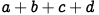

Now let's observe what happens when the fifth value is recorded, e. Since we
are only computing the sum for the last four values, the first value, a, is
replaced with e. So the sum is now:

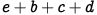

This can be rewritten as follows:

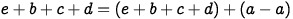

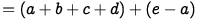

Now let's define the α and ß as follows:

Given these equations, we can infer the following important information:

* α is the previously calculated sum at any given time
* ß is the difference between the newest recorded value and the value
recorded four iterations ago
* the sum of α and ß is the equals the current sum

With this information, we can write a program that only computes value of ß and
adds that value to a sum variable, which represents α:

    var vals = [0,0,0,0],
      lastPt = 0,
      currPt = 0,
      count = 0,

      sum = 0;

    while(true){
      var place = count++ % 4;

      lastPt = vals[place];
      currPt = getValue();
      vals[place] = currPt;

      sum += currPt - lastPt;
    }

You may see a problem here: the correct sum will not be computed until at
least four values are recorded. The solution is to ignore the value of _sum_
until this event occurs, which is when _count_ is greater than or equal to 4.

**Applying to Mean and Variance**

Using the results of the thought experiment presented, I reviewed the
definitions of mean and variance.

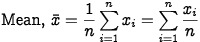

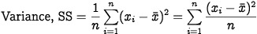

Looking at the definition of mean, it is clean that mean is merely the quotient
of the summation of a given set of numbers over that set's size (or length).
After constructing and analyzing my thought experiment, I realized that the
summation of the equation can be represented as a _"ß-like"_ value, which would
be added to a variable for mean. Also, by the distributive property, each term
of summation is divided by the size of the set of given numbers. So the
_"ß-like"_ value would be divided by that set's size, resulting in the
following snippet of code:

    mean += (currPt - lastPt) / n;    //n being the number of given values

Now, computing the mean is the endeavor of one calculation rather than n
calculations for each of the n given values.

However, while the computation of mean was easy to simplify, variance requires
more thought. The sum within the definition of variance is a complex sum of
squared differences in which one value, the mean, will change from iteration to
iteration. Because of this, I could not apply the same logic I used for
simplifying mean directly to the task of simplifying variance. Thus, I rewrote
the definition of variance as follows:

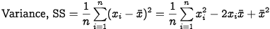

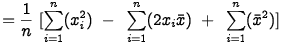

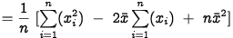

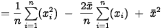

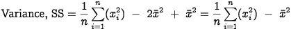

With variance written this way, it became much easier to simplify computation.
Since the value of the mean is known at any time, terms within the rewritten
definition of variance that contained the mean were already solved for. This
left a summation of squared values. I called this term _lambda_. Similar to the
process of simplifying mean, lambda was also a variable to which a a _"ß-like"_
value was added, resulting in code similar to the this:

    lambda += (currPt**2 - lastPt**2) / n;

Once the value of lambda is found, it was then added to the mean terms to
produce the variance. The end result of computing mean and variance finalizes
to code similar to this:

    var vals = [0,0,0,0,0,0,0,0,0,0],
      lastPt = 0,
      currPt = 0,
      count = 0,

      mean = 0,

      variance = 0,
      lambda = 0;

    while(true){
      var place = count++ % 10;

      lastPt = vals[place];
      currPt = getValue();
      vals[place] = currPt;

      mean += (currPt - lastPt) / 10;

      lambda += (currPt**2 - lastPt**2) / 10;
      variance = lambda - mean**2;
    }

**Expectation vs Reality**

Mathematically, this way of computing the mean and variance will produce the
correct respective values. However, during testing, using this exact method
proved to be troubling. After looking at the recorded data, it seemed that the
speed at which to Sphero recorded data was fast enough for the variance between
recordings to always be very small, making detecting when the initial
acceleration of the Sphero very difficult. To combat this issue, a slightly
less accurate value for variance was calculated by the following means:

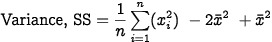

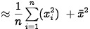

Using this approximation rather than the actual value of variance, the Sphero
was capable of consistently detecting the end of its initial acceleration, thus
allowing for the function to execute properly. This changes the last few lines
code to:

      ...
      lambda += (currPt**2 - lastPt**2) / 10;
      variance = lambda + mean**2;
    }

In the source code you will find the resulting methods of calculating applied
both the gyroscopic sensor's outputs for both pitch and roll.
